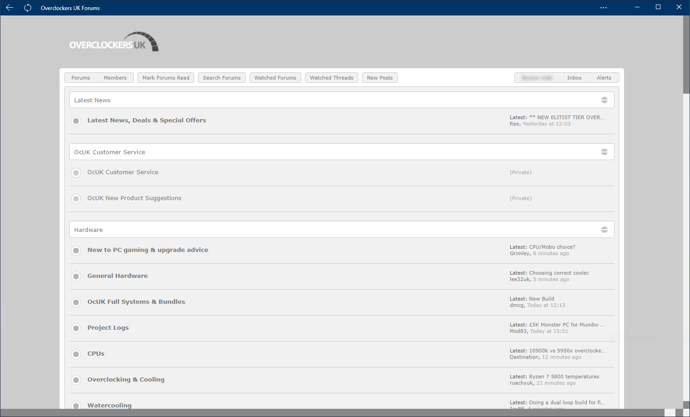

<h1 align="center">
	Xen Minimal White OcUK Theme
</h1>

<h3 align="center">
	Designed by Wiiija
</h3>

<p align="center">
	<strong>
		<a href="https://www.overclockers.co.uk/forums/">Forum Website</a>
		•
		<a href="https://www.overclockers.co.uk/forums/threads/the-ocuk-new-stylish-themes-thread-2017.18769736/">Thread Discussion</a>
	</strong>
</p>

<p align="center">
	<a href="https://overclockers.co.uk/forum"></a>
</p>

<p align="center">
	
</p>

## Description

Piggy backed from Xen Minimal Curvy Neon so not all new code, new code is at the bottom.
Right at the bottom of the code is the following:

/********** Adjust width below according to username length **********/

.formPopup .primaryControls input.textCtrl {
width: 70px;
}

Adjust the width of the Quicksearch bar depending on username length.

If you use and like feel free to buy me a coffee, paypal: rail.monkey@ntlworld.com

<b>Author</b> - Sean Mayes<br />
<b>Date Created</b> - February 19, 2020<br/>
<b>Applies To</b> - overclockers

If you have any problems with this theme please report an issue in the github issue section for this theme.<br/>
https://github.com/el-profesor926/OcUK-Theme-Xen-Minimal-White/issues

## Installation

install notes coming soon:

```install notes coming soon!
```
